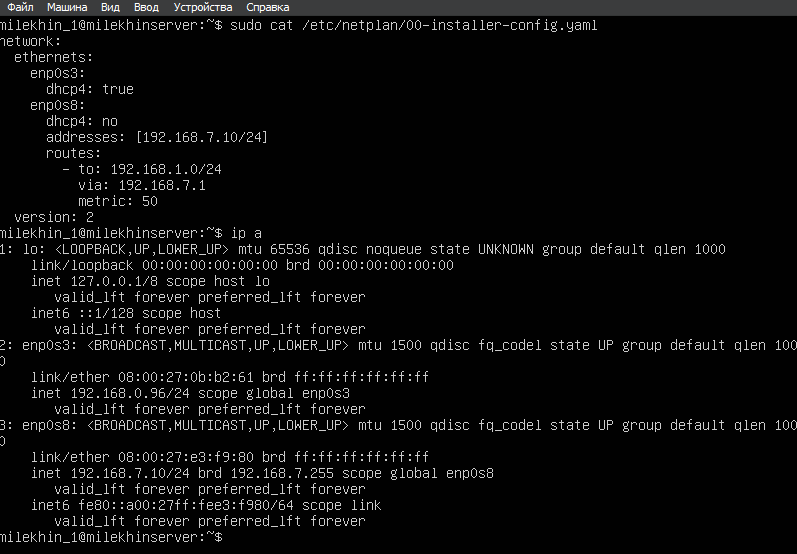
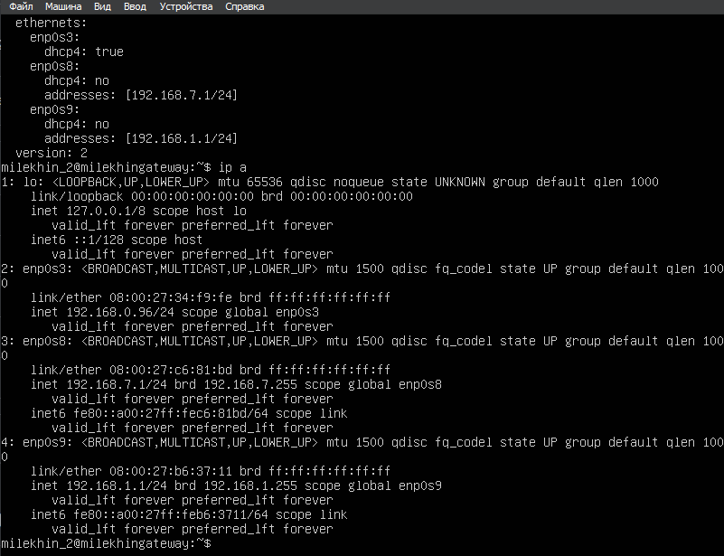
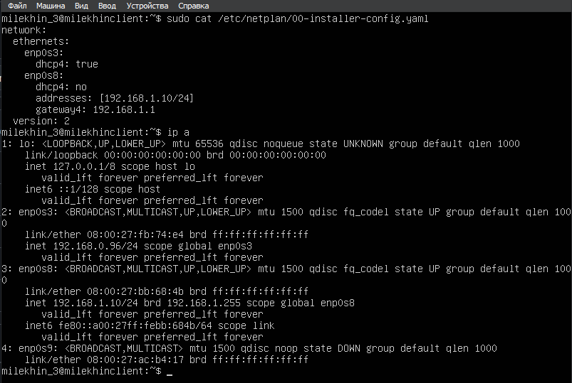
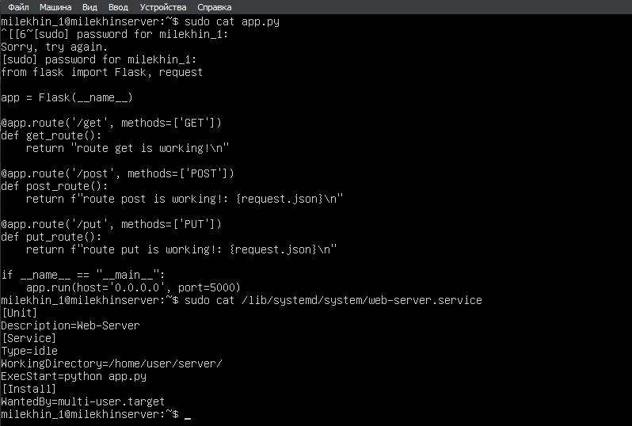
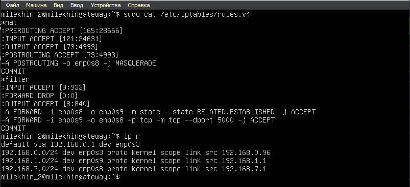
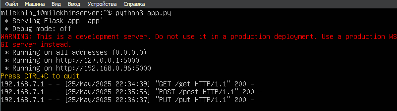
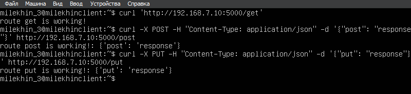
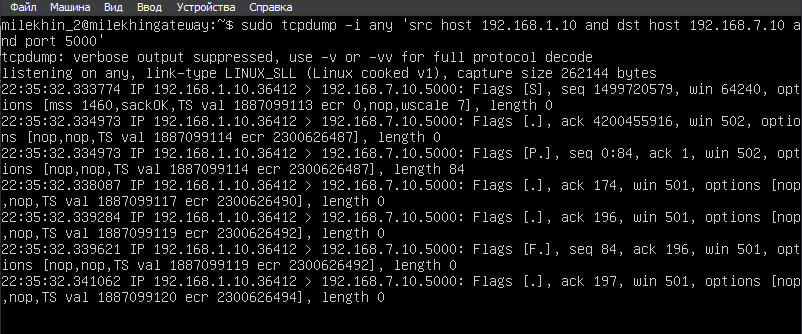
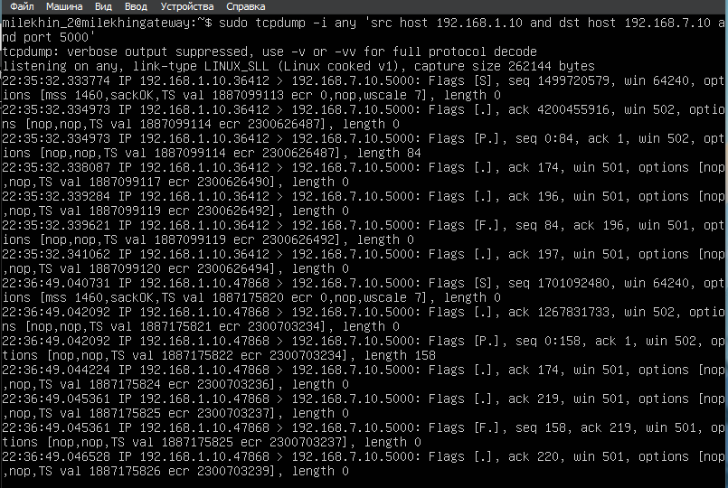
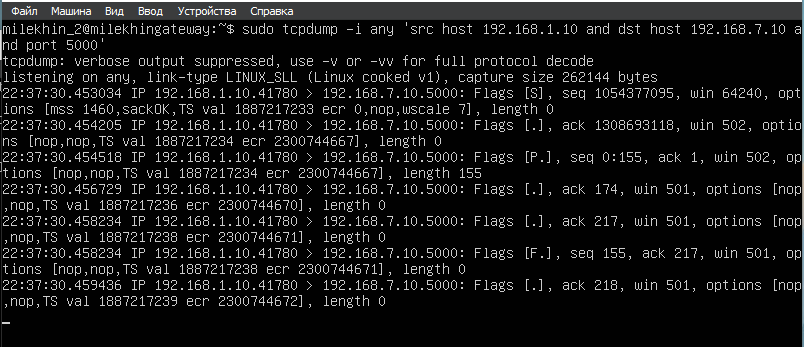

Отчет по практической работе с виртуальными машинами на ОС Linux Ubuntu 24.04.2

---

Для начала создаём и настраиваем виртуальные машины A,B,C: из образа Ubuntu Server создаём машину A, а затем дважды клонируем её. После создания виртуальных машин необходимо добавить им соответствующие сетевые адаптеры (внутренняя сеть) для подсетей servernet и clientnet, а также заменить NAT на сетевой мост (по заданию). После этого на каждой машине вручную задаем новый hostname и user. 
- Для машины A это - user (milekhin_1) и hostname (milekhin_server)
- Для машины B это - user (milekhin_2) и hostname (milekhin_gateway)
- Для машины C это - user (milekhin_3) и hostname (milekhin_client)

---

После настройки виртуальных машин переходим к конфигурации сети. Меняем конфиги netplan на каждой машине по заданию. Для применения новых сетевых настроек используем команду `sudo netplan apply`. День рождения: 07.01.2003.
- Для машины A это - 'enp0s8' - "192.168.7.10/24"
- Для машины B это - 'enp0s8' - "192.168.7.1/24", а для enp0s9 - "192.168.1.1/24"
- Для машины C это - 'enp0s8' - "192.168.1.1/24".

---

ИНДИВИДУАЛЬНАЯ НАСТРОЙКА ВИРТУАЛЬНЫХ МАШИН

---

Перейдем к написанию веб-приложения (для использования Flask его необходимо скачать) на машине A. Реализуем программу с тремя базовыми эндпоинтами.
После реализации программы создаем сервис, которые будет запускать приложение при запуске системы. Весь код приложен ниже:

---

Далее настроим на машине B iptables для маршрутизации пакетов от машины A до машины C. Также необходимо реализовать фильтрацию пакетов по порту 5000. Помимо этого для работы шлюза нужно выставить ip_forward=1 в настройках системы в файле /etc/sysctl.conf. Настройки iptables приложены ниже:

---

ТЕСТИРОВАНИЕ

---

- На машине A: запустим приложение на Flask
- На машине B: запустим tcpdump, чтобы можно было отслеживать пересылку пакетов между машинами A и C
- На машине С: начнём отправлять поочередно три запроса через curl:

Всё безотказно работает, система полностью настроена согласно изначальному заданию.